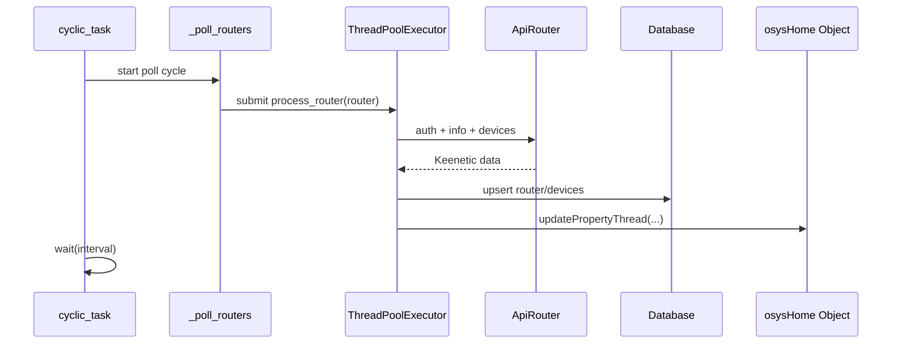

# Keenetic - Technical Reference

## Module Structure

Core files:

| File | Responsibility |
| --- | --- |
| `plugins/Keenetic/__init__.py` | Plugin lifecycle, polling loop, admin handlers, search, widget, object rename handling |
| `plugins/Keenetic/keenetic.py` | Keenetic API client (`ApiRouter`) and connected-device mapping |
| `plugins/Keenetic/models/Router.py` | Router SQLAlchemy model (`keenetic_routers`) |
| `plugins/Keenetic/models/Device.py` | Device SQLAlchemy model (`keenetic_devices`) |
| `plugins/Keenetic/forms/RouterForm.py` | Router form fields and validation |
| `plugins/Keenetic/forms/DeviceForm.py` | Device form fields |
| `plugins/Keenetic/forms/SettingForms.py` | Polling interval settings form |
| `plugins/Keenetic/templates/*.html` | Admin pages and widget template |

---

## Runtime Architecture

`Keenetic` runs as a cyclic polling plugin.

- `cyclic_task()` calls `_poll_routers()`;
- after polling it waits `config.interval` seconds (default `5.0`);
- routers are processed in parallel with `ThreadPoolExecutor`.



### Concurrency guard

To avoid duplicate processing for the same router:

- plugin keeps `_processing_routers` set;
- guarded by `_processing_lock`;
- if router ID is already in set, the task is skipped.

---

## Keenetic API Client

`ApiRouter` uses `requests.Session` and endpoint:

- `http://<host>:<port>` by default;
- `https://<host>:443` when port is `443`.

### Authentication flow

`auth()` logic:

1. `GET /auth`
2. if `401`, read `X-NDM-Realm` and `X-NDM-Challenge`
3. build hash:
   - `md5("username:realm:password")`
   - `sha256(challenge + md5_hex)`
4. `POST /auth` with `{login, password: sha256_hex}`

`isAuth` flag reflects last authentication result.

### API calls used

| Method | Purpose |
| --- | --- |
| `GET /rci/show/ip/hotspot` | Fetch connected clients |
| `POST /rci/` with `show` payload | Fetch system/version/internet/interface info |
| `GET /auth`, `POST /auth` | Session authentication |

---

## Polling Data Flow

For each router record:

1. Load fresh router from DB session.
2. Create/reuse `ApiRouter` instance in `self.routers[ip]`.
3. Authenticate if needed.
4. Fetch `info`:
   - update `router.model`
   - set `router.online = 1/0`
   - update `router.updated`
5. Maintain synthetic `Internet` device (`mac = 0.0.0.0.0.0`):
   - set online from `show.internet.status.internet`
   - set IP from active gateway interface
6. Fetch router `devices` list:
   - upsert by `(router_id, mac)`
   - fallback match by `(router_id, title)` then update MAC
   - update `ip`, `title`, `online`, `updated`
7. Push linked-object property updates when `linked_object` is set.

> [!NOTE]
> Device `online` is derived from `dev.link == 'up'`.

---

## Object Linking Semantics

The plugin stores one link per router/device in field `linked_object`.

### Router link updates

```python
updatePropertyThread(router.linked_object + ".online", router.online, self.name)
```

### Device link updates

```python
updatePropertyThread(device.linked_object + ".ip", device.ip, self.name)
updatePropertyThread(device.linked_object + ".online", device.online, self.name)
updatePropertyThread(device.linked_object + ".signal_strength", rssi, self.name)
updatePropertyThread(device.linked_object + ".rxbytes", dev.rxbytes, self.name)
updatePropertyThread(device.linked_object + ".txbytes", dev.txbytes, self.name)
updatePropertyThread(device.linked_object + ".uptime", dev.uptime, self.name)
```

### Internet synthetic link updates

```python
updatePropertyThread(inet.linked_object + ".ip", inet.ip, self.name)
updatePropertyThread(inet.linked_object + ".online", inet.online, self.name)
```

### Object rename/change handling

`changeObject(...)` updates all `KeeneticDevice.linked_object` values from old object name to new one.

---

## Data Model

### `keenetic_routers` (`Router`)

| Field | Type | Meaning |
| --- | --- | --- |
| `id` | integer | Primary key |
| `title` | string(100) | Display name |
| `model` | string(100) | Router model from API |
| `ip` | string(100) | Router host/IP |
| `port` | integer | API port |
| `login` | string(100) | Router username |
| `password` | string(100) | Router password |
| `online` | integer | Reachability state |
| `linked_object` | string(100) | osysHome object for router status updates |
| `updated` | datetime | Last poll update time |

### `keenetic_devices` (`KeeneticDevice`)

| Field | Type | Meaning |
| --- | --- | --- |
| `id` | integer | Primary key |
| `router_id` | integer | Parent router ID |
| `title` | string(100) | Device name |
| `ip` | string(100) | Device IP |
| `mac` | string(100) | Device MAC |
| `online` | integer | Device online status |
| `linked_object` | string(100) | osysHome object name |
| `updated` | datetime | Last refresh timestamp |

---

## Admin Operations

Entry point: `admin(request)`.

Supported `op` query values:

| `op` | Behavior |
| --- | --- |
| `add` | Create router using `RouterForm` |
| `edit&router=<id>` | Edit router fields |
| `edit&device=<id>` | Edit device fields (`title`, `ip`, `linked_object`) |
| `delete&router=<id>` | Delete router record |
| `delete&device=<id>` | Delete device record |

Other admin pages:

- `?router=<id>` opens router devices table;
- no `op` renders main routers page + settings modal.

### Settings persistence

`SettingsForm.interval` is saved to plugin config key:

```text
config["interval"]
```

---

## Search and Widget Actions

### `search(query)`

Returns list items:

- routers matching `title`, `ip`, `linked_object`;
- devices matching `title`, `linked_object`.

Each result contains admin URL and tag metadata.

### `widget()`

Renders `widget_keenetic.html` with:

- count of routers;
- count of devices.

---

## Error Handling and Resilience

- API call exceptions in `ApiRouter` set `isAuth = False` and return empty/default values.
- Per-router processing is wrapped in `try/finally` to always release processing lock.
- Thread pool future exceptions are logged with router title.

> [!WARNING]
> Because the module is polling-based, temporary API/auth/network failures appear as `offline` until next successful cycle.

---

## Known Caveats

- Router API client cache uses key `self.routers[ip]`; if same IP is reused with different credentials, restart or cache refresh behavior should be considered.
- Transport protocol is selected only by port (`443` => HTTPS, otherwise HTTP).
- Device editor allows editing title/IP manually, but polling can overwrite those values with router-reported data.
- Search uses `.contains(...)` filters and may be case-sensitive depending on DB collation.

> [!CAUTION]
> Deleting router records from admin UI does not describe cascade behavior in this module code itself; verify DB-level constraints for dependent `keenetic_devices` records in your deployment.

---

## Summary

`Keenetic` is a lightweight polling connector that:

- authenticates to Keenetic routers;
- reads internet/router/client status;
- persists records in SQL tables;
- propagates key telemetry fields to linked osysHome objects;
- exposes admin management, search, and widget statistics.

See also:

- [User Guide](USER_GUIDE.md)
- [Module index](index.md)
