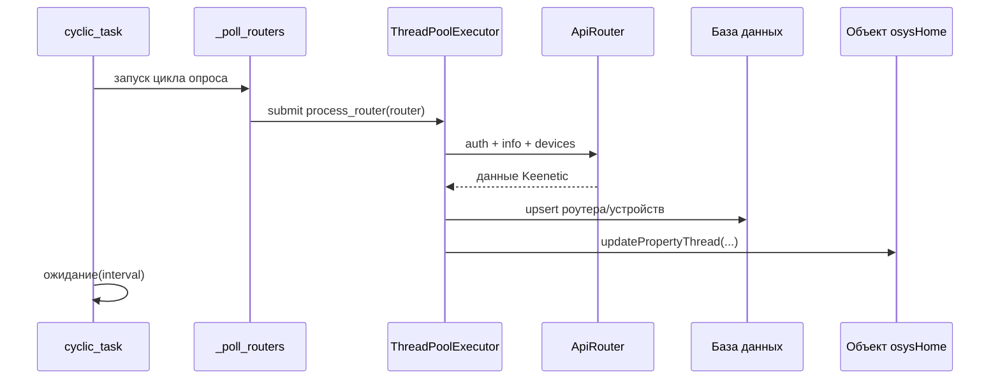
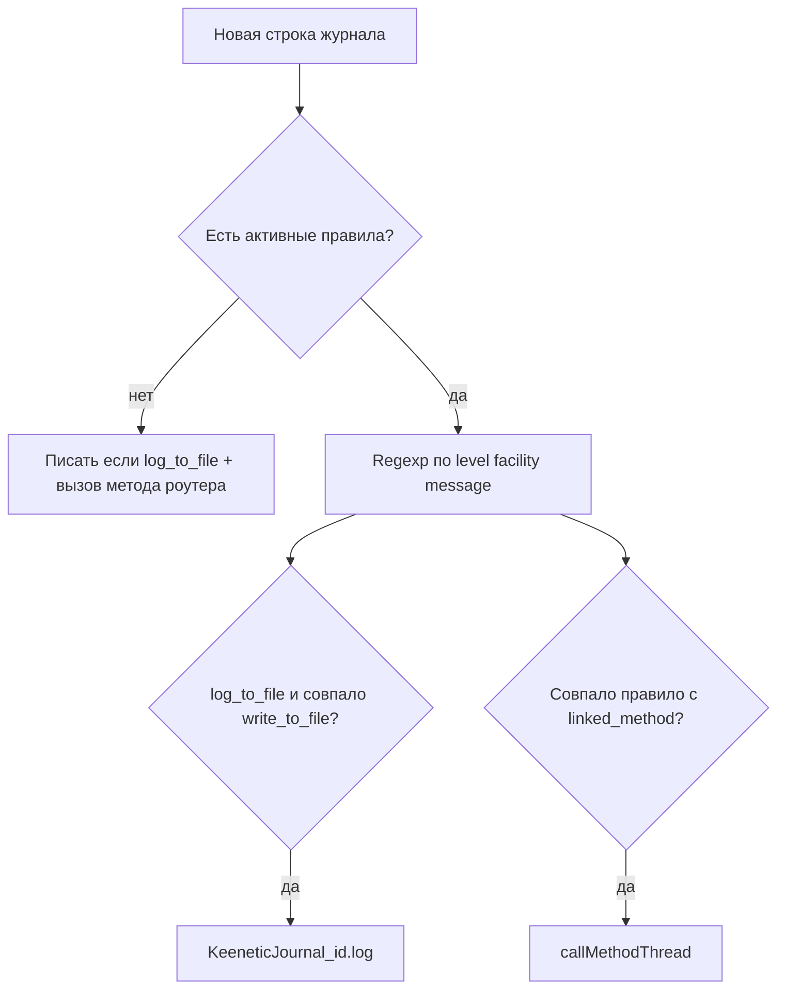

# Keenetic - Техническая документация

## Структура модуля

Основные файлы:

| Файл | Назначение |
| --- | --- |
| `plugins/Keenetic/__init__.py` | Жизненный цикл плагина, цикл опроса, admin-обработчики, поиск, виджет, обработка переименования объектов |
| `plugins/Keenetic/keenetic.py` | API-клиент Keenetic (`ApiRouter`) и маппинг подключенных устройств |
| `plugins/Keenetic/models/Router.py` | SQLAlchemy-модель роутера (`keenetic_routers`) |
| `plugins/Keenetic/models/Device.py` | SQLAlchemy-модель устройства (`keenetic_devices`) |
| `plugins/Keenetic/models/Vpn.py` | SQLAlchemy-модель VPN (`keenetic_vpn`) |
| `plugins/Keenetic/models/LogRule.py` | Правила журнала (`keenetic_log_rules`) |
| `plugins/Keenetic/forms/RouterForm.py` | Форма роутера и валидация |
| `plugins/Keenetic/forms/DeviceForm.py` | Форма устройства |
| `plugins/Keenetic/forms/LogRuleForm.py` | Форма правила журнала |
| `plugins/Keenetic/forms/SettingForms.py` | Форма настройки интервала опроса |
| `plugins/Keenetic/templates/*.html` | Админ-страницы и шаблон виджета |
| `plugins/Keenetic/helpers.py` | Парсинг, sync_live, матчинг regexp правил журнала |
| `plugins/Keenetic/mcp_support.py` | MCP capabilities / CRUD / operations |

---

## Архитектура выполнения

`Keenetic` работает как циклический polling-плагин.

- `cyclic_task()` вызывает `_poll_routers()`;
- после опроса делает паузу `config.interval` секунд (по умолчанию `5.0`);
- роутеры обрабатываются параллельно через `ThreadPoolExecutor`.



### Защита от параллельной обработки одного роутера

Чтобы один и тот же роутер не опрашивался одновременно:

- есть набор `_processing_routers`;
- доступ к нему защищен `_processing_lock`;
- если ID роутера уже в наборе, обработка пропускается.

---

## API-клиент Keenetic

`ApiRouter` использует `requests.Session` и endpoint:

- `http://<host>:<port>` по умолчанию;
- `https://<host>:443`, если порт равен `443`.

### Поток авторизации

Логика `auth()`:

1. `GET /auth`
2. если `401`, читаются `X-NDM-Realm` и `X-NDM-Challenge`
3. строится хэш:
   - `md5("username:realm:password")`
   - `sha256(challenge + md5_hex)`
4. выполняется `POST /auth` с `{login, password: sha256_hex}`

Флаг `isAuth` отражает результат последней авторизации.

### Используемые вызовы API

| Метод | Назначение |
| --- | --- |
| `GET /rci/show/ip/hotspot` | Получить список подключенных клиентов |
| `POST /rci/` с payload `show` | Получить system/version/internet/interface информацию |
| `GET /auth`, `POST /auth` | Аутентификация сессии |

---

## Поток обработки данных при опросе

Для каждой записи роутера:

1. Загружается свежий роутер из сессии БД.
2. Создается/переиспользуется `ApiRouter` в `self.routers[ip]`.
3. При необходимости выполняется авторизация.
4. Читается `info`:
   - обновляется `router.model`
   - выставляется `router.online = 1/0`
   - обновляется `router.updated`
5. Поддерживается синтетическое устройство `Internet` (`mac = 0.0.0.0.0.0`):
   - online берется из `show.internet.status.internet`
   - IP берется из активного gateway interface
6. Читается список `devices`:
   - upsert по `(router_id, mac)`
   - fallback-поиск по `(router_id, title)` с обновлением MAC
   - обновление `ip`, `title`, `online`, `updated`
7. При наличии `linked_object` отправляются обновления свойств объекта.

> [!NOTE]
> Статус устройства `online` вычисляется как `dev.link == 'up'`.

---

## Семантика привязки к объектам

У роутера и устройства хранится одна привязка в поле `linked_object`.

### Обновления для роутера

```python
updatePropertyThread(router.linked_object + ".online", router.online, self.name)
```

### Обновления для устройства

```python
updatePropertyThread(device.linked_object + ".ip", device.ip, self.name)
updatePropertyThread(device.linked_object + ".online", device.online, self.name)
updatePropertyThread(device.linked_object + ".signal_strength", rssi, self.name)
updatePropertyThread(device.linked_object + ".rxbytes", dev.rxbytes, self.name)
updatePropertyThread(device.linked_object + ".txbytes", dev.txbytes, self.name)
updatePropertyThread(device.linked_object + ".uptime", dev.uptime, self.name)
```

### Обновления для синтетического `Internet`

```python
updatePropertyThread(inet.linked_object + ".ip", inet.ip, self.name)
updatePropertyThread(inet.linked_object + ".online", inet.online, self.name)
```

### Переименование/изменение объекта

`changeObject(...)` обновляет `KeeneticDevice.linked_object` со старого имени объекта на новое.

---

## Модель данных

### `keenetic_routers` (`Router`)

| Поле | Тип | Смысл |
| --- | --- | --- |
| `id` | integer | Первичный ключ |
| `title` | string(100) | Отображаемое имя |
| `model` | string(100) | Модель роутера из API |
| `ip` | string(100) | Хост/IP роутера |
| `port` | integer | Порт API |
| `login` | string(100) | Логин роутера |
| `password` | string(100) | Пароль роутера |
| `online` | integer | Состояние доступности |
| `linked_object` | string(100) | Объект osysHome для статуса роутера |
| `linked_method` | string(100) | Метод: firmware_update; legacy-журнал без правил |
| `poll_log` | integer | 1 = опрашивать `show log` |
| `log_to_file` | integer | 1 = мастер-флаг записи в файл журнала |
| `updated` | datetime | Время последнего обновления |

### `keenetic_devices` (`KeeneticDevice`)

| Поле | Тип | Смысл |
| --- | --- | --- |
| `id` | integer | Первичный ключ |
| `router_id` | integer | ID родительского роутера |
| `title` | string(100) | Имя устройства |
| `ip` | string(100) | IP устройства |
| `mac` | string(100) | MAC устройства |
| `online` | integer | Онлайн-статус устройства |
| `linked_object` | string(100) | Имя объекта osysHome |
| `updated` | datetime | Время последнего обновления |

### `keenetic_log_rules` (`KeeneticLogRule`)

| Поле | Тип | Смысл |
| --- | --- | --- |
| `id` | integer | Первичный ключ |
| `router_id` | integer | Роутер |
| `title` | string(100) | Имя правила |
| `pattern` | string(255) | regexp |
| `write_to_file` | integer | 1 = писать совпадение в файл **только если** у роутера `log_to_file=1` |
| `linked_object` | string(100) | Объект для вызова метода (нужен вместе с `linked_method`) |
| `linked_method` | string(100) | Метод при совпадении |
| `active` | integer | 0/1 |

---

## Правила журнала

При `poll_log` цикл вызывает `_poll_log` → для каждой **новой** строки `_apply_log_rules`.

Матч: `re.search(pattern, "{level} {facility} {message}")` (`helpers.match_log_rule`). Невалидный pattern — warning в лог плагина, правило пропускается.



- Первый снимок журнала — baseline: буфер UI заполняется, методы/файл **не** вызываются.
- `EVENT=firmware_update` не идёт через правила журнала.

---

## Административные операции

Точка входа: `admin(request)`.

Поддерживаемые значения `op`:

| `op` | Поведение |
| --- | --- |
| `add` | Создание роутера через `RouterForm` |
| `add&log_rule&router=<id>` | Создание правила журнала |
| `edit&router=<id>` | Редактирование полей роутера |
| `edit&device=<id>` | Редактирование устройства (`title`, `ip`, `linked_object`) |
| `edit&log_rule=<id>` | Редактирование правила журнала |
| `delete&router=<id>` | Удаление роутера (+ devices/vpn/log_rules) |
| `delete&device=<id>` | Удаление записи устройства |
| `delete&log_rule=<id>` | Удаление правила журнала |

Другие admin-страницы:

- `?router=<id>` открывает таблицу устройств роутера;
- без `op` рендерится главная страница роутеров и модальное окно настроек.

### Сохранение настроек

`SettingsForm.interval` сохраняется в конфиг плагина:

```text
config["interval"]
```

---

## Действия поиска и виджета

### `search(query)`

Возвращает элементы:

- роутеры по `title`, `ip`, `linked_object`;
- устройства по `title`, `linked_object`.

Каждый результат содержит URL админки и теги.

### `widget()`

Рендерит `widget_keenetic.html` с:

- количеством роутеров;
- количеством устройств.

---

## Обработка ошибок и устойчивость

- Исключения в `ApiRouter` переводят `isAuth` в `False` и возвращают пустые/безопасные значения.
- Обработка роутера обернута в `try/finally`, чтобы гарантированно снять lock.
- Исключения `future` в пуле потоков логируются с именем роутера.

> [!WARNING]
> Поскольку модуль работает по polling-модели, кратковременные ошибки API/сети проявляются как `offline` до следующего успешного цикла.

---

## Известные нюансы

- Кэш API-клиентов использует ключ `self.routers[ip]`; если один IP переиспользуется с другими учетными данными, нужно учитывать поведение кэша.
- Протокол выбирается только по порту (`443` => HTTPS, иначе HTTP).
- В редакторе устройства можно вручную менять title/IP, но при следующем опросе эти значения могут быть перезаписаны данными роутера.
- Поиск использует фильтры `.contains(...)`, чувствительность к регистру зависит от collation базы.

> [!CAUTION]
> При удалении роутера из админки каскадное удаление зависимых `keenetic_devices` не описано кодом модуля напрямую; проверьте ограничения и каскады в вашей БД.

---

## Резюме

`Keenetic` это легковесный polling-коннектор, который:

- авторизуется на роутерах Keenetic;
- читает состояние интернета, роутера и клиентов;
- сохраняет записи в SQL-таблицы;
- прокидывает ключевую телеметрию в привязанные объекты osysHome;
- предоставляет админ-управление, поиск и виджет статистики.

См. также:

- [Руководство пользователя](USER_GUIDE.ru.md)
- [Индекс модуля](index.ru.md)
