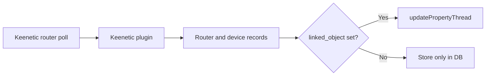

# Keenetic - User Guide


## Purpose

`Keenetic` integrates Keenetic routers with osysHome.

The module is designed to:

- connect to one or more Keenetic routers over HTTP/HTTPS;
- poll connected clients and internet status in the background;
- store routers and devices in the module database;
- link router and client records to osysHome objects;
- update linked object properties automatically.

> [!IMPORTANT]
> The current implementation is monitoring-focused. It updates osysHome properties from router data but does not send control commands back to Keenetic clients.

---

## What You Get

| Capability | What it does |
| --- | --- |
| Multi-router support | Monitors several Keenetic routers in one module |
| Device inventory | Stores discovered clients per router with IP, MAC, online state, update time |
| Internet pseudo-device | Adds a special `Internet` record to track WAN online/IP state |
| Object linking | Binds router or client record to one osysHome object (`linked_object`) |
| Dashboard widget | Shows total router/device counters |
| Search integration | Finds routers and devices through global search |

---

## Interface Overview

Admin page:

```text
/admin/Keenetic
```

Main actions in UI:

1. `Settings`
2. `Add router`
3. `Devices` (open router clients)
4. `Edit` (router or device)
5. `Delete`

### Router list columns

| Column | Meaning |
| --- | --- |
| `Title` | Router display name |
| `Model` | Router model from Keenetic API |
| `IP` | Router host/IP configured in module |
| `Online` | Current reachability result of latest poll |
| `Updated` | Last time router record was refreshed |

### Device list columns

| Column | Meaning |
| --- | --- |
| `Title` | Client name reported by router |
| `IP` | Client IP |
| `MAC` | Client MAC address |
| `Online` | Link status (`up` -> Online) |
| `Linked object` | osysHome object bound to this record |
| `Updated` | Last update timestamp |

---

## Quick Start Checklist

- [ ] Open `/admin/Keenetic`.
- [ ] Click `Add router`.
- [ ] Fill `Name`, `IP`, `Port`, `Username`, `Password`.
- [ ] Optionally set `Linked object` for router-level status.
- [ ] Save the router.
- [ ] Open `Settings` and confirm polling interval.
- [ ] Open router `Devices` and link needed clients to objects.

---

## Adding and Editing a Router

Use `Add router` or `Edit` and fill:

| Field | Required | Description |
| --- | --- | --- |
| `Name` (`title`) | Yes | Router name in UI |
| `IP` (`ip`) | Yes | Router IP/hostname |
| `Port` (`port`) | Yes | API port (`80` for HTTP, `443` for HTTPS) |
| `Username` (`login`) | Yes | Keenetic login |
| `Password` (`password`) | Yes | Keenetic password |
| `Linked object` | No | osysHome object name for router-level updates |

Example:

```yaml
router:
  title: Home Router
  ip: 192.168.1.1
  port: 80
  login: admin
  password: your_password
  linked_object: Router.Home
```

---

## Polling Settings

`Settings` contains one key option:

| Field | Default | Meaning |
| --- | --- | --- |
| `Update interval` | `5` seconds | Delay between polling cycles |

> [!TIP]
> Use a larger interval (for example `10-30` seconds) if you monitor many routers and clients.

---

## Linking to osysHome Objects

Both routers and devices can be linked to one object via `linked_object`.

Examples:

```text
Router.Home
```

```text
Phone.John
```

When data changes, module writes values into object properties automatically.

---

## What Is Updated in Linked Objects

### Router link (`router.linked_object`)

Updated property:

- `<linked_object>.online`

### Device link (`device.linked_object`)

Updated properties:

- `<linked_object>.ip`
- `<linked_object>.online`
- `<linked_object>.signal_strength`
- `<linked_object>.rxbytes`
- `<linked_object>.txbytes`
- `<linked_object>.uptime`

### Internet pseudo-device

For each router, module maintains a synthetic device:

- `title = Internet`
- `mac = 0.0.0.0.0.0`

If that synthetic record has a `linked_object`, module updates:

- `<linked_object>.ip`
- `<linked_object>.online`



---

## Search and Widget

### Search

Global search action returns:

- router hits by `title`, `ip`, `linked_object`;
- device hits by `title`, `linked_object`.

### Widget

Dashboard widget shows:

- total routers;
- total devices.

---

## Troubleshooting

### Router stays offline

Check:

- router IP and port are correct;
- login/password are valid;
- API endpoint is reachable from osysHome server;
- correct protocol is selected by port (`80` HTTP, `443` HTTPS).

### Devices do not appear

Check:

- router authentication succeeded;
- clients exist on router;
- polling interval is not too large;
- Keenetic API response `/rci/show/ip/hotspot` is available.

### Linked object does not update

Check:

- `linked_object` is set and saved;
- object exists in osysHome;
- target properties are expected by your logic;
- module cycle is running.

> [!WARNING]
> Empty `linked_object` value in device editor is normalized to `NULL` in database, so updates stop until you set it again.

---

## Notes and Limitations

- Data collection is periodic polling, not event subscription.
- Router control actions are not implemented; module is primarily a telemetry bridge.
- API client cache key is router IP, so changing credentials/IP should be done carefully.
- Deleting router/device from admin UI removes its database record.

---

## See Also

- [Technical Reference](TECHNICAL_REFERENCE.md)
- [Module index](index.md)
