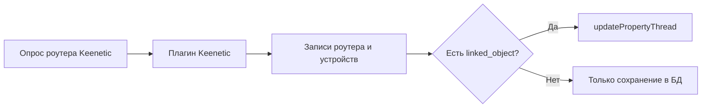

# Keenetic - Руководство пользователя


## Назначение

`Keenetic` интегрирует роутеры Keenetic с osysHome.

Модуль нужен, чтобы:

- подключаться к одному или нескольким роутерам Keenetic по HTTP/HTTPS;
- в фоне опрашивать подключенные устройства и состояние интернета;
- хранить роутеры и устройства в базе модуля;
- привязывать записи роутеров и устройств к объектам osysHome;
- автоматически обновлять свойства привязанных объектов.

> [!IMPORTANT]
> Текущая реализация ориентирована на мониторинг. Модуль обновляет свойства osysHome по данным роутера, но не отправляет команды управления обратно на клиентов Keenetic.

---

## Что получает пользователь

| Возможность | Что делает |
| --- | --- |
| Поддержка нескольких роутеров | Мониторит несколько роутеров Keenetic в одном модуле |
| Реестр устройств | Хранит найденных клиентов по каждому роутеру (IP, MAC, online, время обновления) |
| Псевдо-устройство `Internet` | Создает специальную запись для контроля состояния WAN и внешнего IP |
| Привязка к объектам | Привязывает роутер или устройство к одному объекту osysHome (`linked_object`) |
| Виджет | Показывает счетчики роутеров и устройств |
| Интеграция с поиском | Находит роутеры и устройства через глобальный поиск |

---

## Обзор интерфейса

Страница администратора:

```text
/admin/Keenetic
```

Основные действия в интерфейсе:

1. `Settings`
2. `Add router`
3. `Devices` (просмотр клиентов роутера)
4. `Edit` (роутер или устройство)
5. `Delete`

### Колонки списка роутеров

| Колонка | Значение |
| --- | --- |
| `Title` | Отображаемое имя роутера |
| `Model` | Модель роутера из Keenetic API |
| `IP` | Хост/IP, указанный в настройке |
| `Online` | Результат последнего опроса доступности |
| `Updated` | Время последнего обновления записи |

### Колонки списка устройств

| Колонка | Значение |
| --- | --- |
| `Title` | Имя клиента, которое вернул роутер |
| `IP` | IP клиента |
| `MAC` | MAC-адрес клиента |
| `Online` | Статус линка (`up` -> Online) |
| `Linked object` | Привязанный объект osysHome |
| `Updated` | Время последнего обновления |

---

## Чек-лист быстрого запуска

- [ ] Откройте `/admin/Keenetic`.
- [ ] Нажмите `Add router`.
- [ ] Заполните `Name`, `IP`, `Port`, `Username`, `Password`.
- [ ] При необходимости укажите `Linked object` для статуса роутера.
- [ ] Сохраните роутер.
- [ ] Откройте `Settings` и проверьте интервал опроса.
- [ ] Откройте `Devices` и привяжите нужные устройства к объектам.

---

## Добавление и редактирование роутера

Используйте `Add router` или `Edit` и заполните:

| Поле | Обязательно | Описание |
| --- | --- | --- |
| `Name` (`title`) | Да | Имя роутера в интерфейсе |
| `IP` (`ip`) | Да | IP/hostname роутера |
| `Port` (`port`) | Да | Порт API (`80` для HTTP, `443` для HTTPS) |
| `Username` (`login`) | Да | Логин Keenetic |
| `Password` (`password`) | Да | Пароль Keenetic |
| `Linked object` | Нет | Имя объекта osysHome для обновлений роутера |

Пример:

```yaml
router:
  title: Home Router
  ip: 192.168.1.1
  port: 80
  login: admin
  password: your_password
  linked_object: Router.Home
```

---

## Настройки опроса

В `Settings` есть ключевой параметр:

| Поле | По умолчанию | Значение |
| --- | --- | --- |
| `Update interval` | `5` секунд | Пауза между циклами опроса |

> [!TIP]
> Если роутеров и клиентов много, увеличьте интервал (например, до `10-30` секунд), чтобы снизить нагрузку.

---

## Привязка к объектам osysHome

И у роутера, и у устройства есть одно поле привязки `linked_object`.

Примеры:

```text
Router.Home
```

```text
Phone.John
```

При изменении данных модуль автоматически обновляет свойства этого объекта.

---

## Что обновляется в привязанных объектах

### Привязка роутера (`router.linked_object`)

Обновляемое свойство:

- `<linked_object>.online`

### Привязка устройства (`device.linked_object`)

Обновляемые свойства:

- `<linked_object>.ip`
- `<linked_object>.online`
- `<linked_object>.signal_strength`
- `<linked_object>.rxbytes`
- `<linked_object>.txbytes`
- `<linked_object>.uptime`

### Псевдо-устройство интернета

Для каждого роутера модуль поддерживает синтетическую запись:

- `title = Internet`
- `mac = 0.0.0.0.0.0`

Если у этой записи задан `linked_object`, обновляются:

- `<linked_object>.ip`
- `<linked_object>.online`



---

## Поиск и виджет

### Поиск

Действие глобального поиска возвращает:

- роутеры по `title`, `ip`, `linked_object`;
- устройства по `title`, `linked_object`.

### Виджет

Виджет на дашборде показывает:

- общее число роутеров;
- общее число устройств.

---

## Диагностика

### Роутер остается offline

Проверьте:

- корректность IP и порта роутера;
- правильность логина и пароля;
- доступность API роутера с сервера osysHome;
- корректный выбор протокола по порту (`80` HTTP, `443` HTTPS).

### Устройства не появляются

Проверьте:

- прошла ли авторизация на роутере;
- есть ли клиенты на роутере;
- не слишком ли большой интервал опроса;
- доступен ли ответ Keenetic API `/rci/show/ip/hotspot`.

### Не обновляется привязанный объект

Проверьте:

- `linked_object` заполнен и сохранен;
- объект существует в osysHome;
- в логике объекта предусмотрены нужные свойства;
- у модуля запущен цикл опроса.

> [!WARNING]
> Пустое значение `linked_object` в редакторе устройства сохраняется как `NULL` в базе, поэтому обновления прекращаются, пока привязка не будет указана снова.

---

## Заметки и ограничения

- Сбор данных сделан как периодический polling, а не подписка на события.
- Команды управления роутером/клиентами не реализованы, модуль работает как телеметрический мост.
- Кэш API-клиентов индексируется по IP роутера, поэтому изменения IP/учетных данных лучше делать аккуратно.
- Удаление роутера или устройства через админку удаляет запись из базы модуля.

---

## См. также

- [Техническая документация](TECHNICAL_REFERENCE.ru.md)
- [Индекс модуля](index.ru.md)
